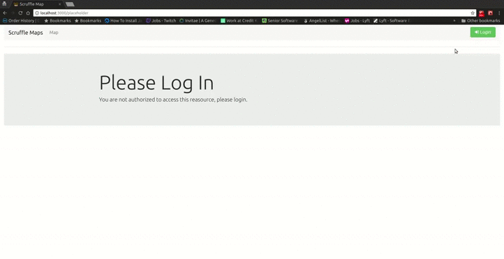
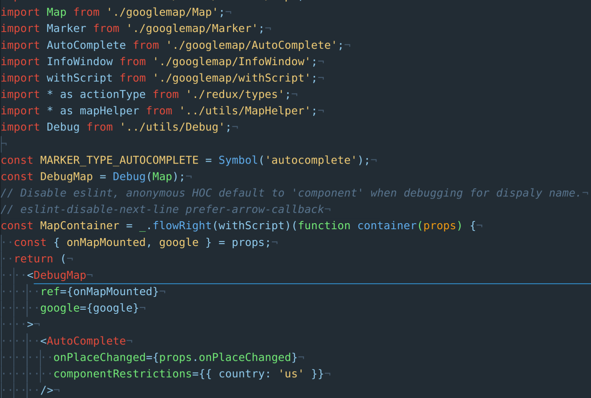
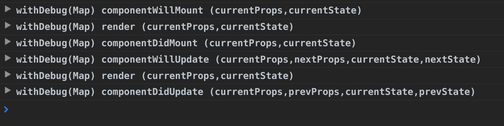

# Scruffle Maps - React + Redux + Google Map + Docker

## Description
The purpose of this project is to demonstrate a working [React](https://facebook.github.io/react/) and Google Maps implementation that allows a user to search for locations and save them as favorites. This is my first iteration into [ECMAScript](https://www.ecma-international.org/ecma-262/7.0/index.html), [Webpack](https://webpack.js.org/), [Babel](https://babeljs.io/), [Redux](http://redux.js.org/), [React](https://facebook.github.io/react/), [Express](), [ESLint](http://eslint.org/), [Jest/Jest-cli](https://facebook.github.io/jest/), [Enzyme](http://airbnb.io/enzyme/index.html), [Nightwatch](http://nightwatchjs.org/) and [Docker](). My hopes is that this project might provide insight into others on how [React](https://facebook.github.io/react/) may be used to build rich complex nested components that integrate with 3rd party API's like Google Maps and [Auth0](https://auth0.com/).

## Motivation
My personal motivation for this project was to give myself 30 days find out what my development and comprehension velocities are when learning new concepts from scratch. As my understanding and application of these technologies has improved, so did my vision of whats to come and how this project will continue to evolve. Please see [Future Work](#future-work) for more information on the direction of the project. This has been to a fun project so look out for it to continually evolve!

# Demo
* [Demo link](http://mrscruffles.io)
* login
  * user: `test@test.com`
  * pass: `1234`

## Known Issues
1. #### IOS and Apple Devices do not render InfoWindow when searching locations.
 * The application has not been cross platform tested and will likely have issues on some devices. The application should work correctly in the latest versions of popular non Apple browsers (Chrome, FireFox).
1. #### Favorite functionality does not work in demo but works locally.
 * The demo is hosted with AWS under their Elastic Beanstalk service. The service is designed primarily to abstract away as much hosting configuration as possible and its flexibility is limited by design. That being said, the container that the demo runs in has two concerns, the express server and the [json-server](https://github.com/typicode/json-server) (simulates a JSON API that handles requests to persist, remove and retrieve marker data from front-end) listening on separate ports in the container. Elastic Beanstalk does not allow you to configure port mapping for multiple exposed ports between the host and a single container.

# Setup
* Install dependencies
  * run ```yarn install ```
* Sign up at Google to get an API key -[Instructions](https://developers.google.com/maps/documentation/javascript/get-api-key)
* Sign up for [Auth0](https://auth0.com/) account and create user - [Instructions](https://auth0.com/docs/quickstart/spa/react#application-keys)
  * Get **AUTH0_CLIENT_ID** and **AUTH0_DOMAIN** from dashboard.
  * Set **Allowed Callback URLs** and **Allowed Origins (CORS)**: **http://localhost:3000/login**
* Setup .env
  * run ```cp .env.example .env```
  * Fill in the {CLIENT_ID}, {DOMAIN} and {MAP_API_KEY} from the previous steps.
* Configure mockapi db and start.
  * run ```bash ./resetdb.sh```
  * run ```yarn run server:mockapi```
* Configure e2e dependencies.
  * run ```yarn run test:update-selenium```
* Run server
<br> You may choose either dev server which runs in memory to to build the endstates and run via express server.
  * Dev server
  <br> run ```yarn run server:dev```
  * Express server
  <br> run ```yarn run build:dev```
  <br> run ```yarn run server:express```
* Navigate to __localhost:3000__



# Components
## GoogleMap - Container
The GoogleMap component is the primary container component. This component is not only responsible for defining the map but also handling all of the interactions and state that pertain to the map. When this component renders it gets wrapped by withScript (HOC Props Proxy) which will load the google api into the window object. Once it has successfully loaded, it will render the GoogleMap container component which will render (Map, AutoComplete, Marker, and InfoWindow).

## Debug
This component (HOC Inheritance Inversion) is a debugging tool to show a components life cycle events as well as their props and state. This is incredibly helpful when learning the lifecycle states of components and debugging them.

  * Basic usage: *GoogleMap.jsx*
  
  

# Commands
* **build:clean**
  <br>Removes static assets, logs, and reports.
* **build:dev**
  <br>Buids dev assets to /dist folder.
* **build:prod**
  <br>Builds production assets /dist folder.
* **server:dev**
  <br>Starts dev server.
* **server:mockapi**
  <br>Starts mock json api.
* **start**
  <br>Starts express server.
* **test**
  <br>Runs unit tests.
* **test:watch**
  <br>Runs unit tests in watch mode.
* **test:update-selenium**
  <br>Downlaods latest versions of chrome driver and selenium and installs them in `node_modules/nightwatch/bin/`
* **test:e2e**
  <br>Runs e2e tests.

# Testing
This project uses [Jest/Jest-cli](https://facebook.github.io/jest/) as the unit test framework in combination with [Enzyme](http://airbnb.io/enzyme/index.html) to provide DOM manipulation and traversal. Additionally, [Nightwatch](http://nightwatchjs.org/) is utlized as an e2e testing framework that runs against [Selenium](http://www.seleniumhq.org/) and [Chromedriver](https://sites.google.com/a/chromium.org/chromedriver/) for browser automation.
* Unit Testing:
 * Run command `yarn run test` or `yarn run test:watch`. If run with `test:watch` the unit tests will automatically run when the related unit code has changed.
* Integration Testing:
  * Run command `yarn run test:e2e`. This command will automatically start up the selenium server and begin running integration tests.
  * **NOTE** Make sure you've run `yarn run test:update-selenium` as part of the setup instructions seen [above](#setup) and have [Chrome](https://www.google.com/chrome/) installed.

# Docker
## Build Image
* Option 1:
  * run command `bash ./prepublish`
* Option 2:
  1. `yarn run build:prod -- --progress`
  1. `sudo docker build -t scruffle-map .`

## Run Container
* run `sudo docker run --rm -p 3000:80 -p 3001:3001 -it scruffle-map`

# Future Work
There is no doubt room for improvement with the current code. This was put together within a very short period of time without peer review. That being said, some next steps are:

#### Build RESTful JSON API
* Right now the marker favorites state is managed by a simple JSON file that just stores the structure of the marker via the mock API ([json-server](https://github.com/typicode/json-server)). This is just a stop gap to get the front end working first. Ideally we would want to separate this concern to its own service so that it can be consumed by other applications.

#### Build Continuous Integration and Deployment Pipeline.
* The current process to validate and deploy the code is manual. This process can be automated via CI tools like Jenkins or Travis CI in conjunction AWS build pipelines to streamline application builds, validation, containerization and deployment process's.

#### Configure a Multi Container Docker environment
* Currently the application is configured to be a single container environment. However when the JSON API is built with a corresponding data store these concerns should be containerized and configured to work in a multi container environment.

#### Integrate user information from Auth0.
* Currently the application integrates with [Auth0](https://auth0.com/) but only recognizes a single user and not multiple when managing marker state. This will allow multiple users to save their own favorites.

#### Publish npm googlemap package.
* All of the components (AutoComplete, InfoWindow, Map, Marker, and withScript) are designed to have their state managed by an HOC. This can be abstracted away from the current code base and just pulled in as an node package.
